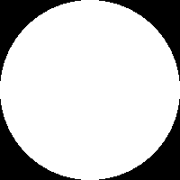

<!-- omit in toc -->
# 2D Permutation Toolbox

Tools for developing algorithms that work with permutations of data in 2D grids (i.e. images).

<!-- omit in toc -->
## Example

Instructions for running the example are in [`image_annealing_cli_bin/examples/dot/README.md`](./image_annealing_cli_bin/examples/dot/README.md). Before running the example, follow the [repository setup instructions](#setup) below.

<!-- omit in toc -->
## Table of Contents

- [Problem description](#problem-description)
  - [Description using an analogy](#description-using-an-analogy)
  - [Abstract description](#abstract-description)
  - [Why permutations?](#why-permutations)
    - [Advantages of permutations](#advantages-of-permutations)
    - [Disadvantages of permutations](#disadvantages-of-permutations)
- [Setup](#setup)
  - [Supported platforms](#supported-platforms)
  - [Getting started](#getting-started)
- [Troubleshooting](#troubleshooting)
  - [Code panics with errors such as BadDisplay, BadContext, or NotInitialized](#code-panics-with-errors-such-as-baddisplay-badcontext-or-notinitialized)
- [Usage overview](#usage-overview)
  - [Data types](#data-types)
    - [Vector fields](#vector-fields)
      - [Permutations](#permutations)
      - [Displacement goals](#displacement-goals)
    - [Images](#images)
  - [Operations](#operations)
    - [Create permutation](#create-permutation)
    - [Swap](#swap)
    - [Permute](#permute)
    - [Validate permutation](#validate-permutation)
- [Vision and future development](#vision-and-future-development)
  - [Planned development](#planned-development)
- [Contributing](#contributing)
- [Contact](#contact)
- [License](#license)

## Problem description

### Description using an analogy

Suppose there is a crowd of people in a room. You want to determine the path that each person takes over time. Each person may either have a destination they want to reach, or may want to be closer to either specific people, or to people matching a certain description. In brief, the criteria that determine how people move are arbitrary.

### Abstract description

Find a permutation of data arranged in a 2D grid by swapping adjacent data elements in an attempt to decrease the value of some cost function that evaluates permutations. There is no guarantee that you will find a permutation corresponding to a global minimum of the cost function, but you will at least obtain a sequence of intermediate permutations (wherein each element moves at most one unit of distance) that relates the initial and final arrangements of the data.

### Why permutations?

Images can be modelled as functions mapping pixel coordinates to colors. We think most image processing algorithms focus on the output of the mapping, modifying the colors. There are overlooked opportunities to explore operations on the input of the mapping, the coordinates. We want to experiment with rearranging the structures of images.

#### Advantages of permutations

[Permutations](https://en.wikipedia.org/wiki/Permutation) have some nice properties:

- Permutations are linear operators
- Permutations are invertible
- Permutations can be applied to any kind of data, not only to numbers
- Permuting numbers does not result in round-off (quantization) error
- Permutations preserve cardinality (area, in the case of digital images)
- Any permutation can be decomposed into a sequence of permutations wherein each element is either stationary or trades places with its nearest neighbors
- The motions of elements according to a permutation can be evaluated in parallel

#### Disadvantages of permutations

Finding a permutation that satisfies a given set of criteria is usually a hard combinatorial optimization problem. The [travelling salesperson problem](https://en.wikipedia.org/wiki/Travelling_salesman_problem) is an example of such a problem.

In this project, we use [simulated annealing](https://mathworld.wolfram.com/SimulatedAnnealing.html) to optimize permutations. Simulated annealing is easy to parallelize because each trade can be evaluated using only local information.

## Setup

This project is written in [Rust](https://www.rust-lang.org/), and uses the [wgpu](https://wgpu.rs/) library to parallelize image processing algorithms on the GPU. GPU shader programs are currently written in [WGSL (WebGPU Shading Language)](https://gpuweb.github.io/gpuweb/wgsl/).

We provide a command-line interface (CLI) that exposes the main functionality of the codebase. Therefore, you do not need to work with Rust code directly, but you still Rust development tools for the code to build. Presently, the CLI is best documented by the [example](./image_annealing_cli_bin/examples/dot/README.md).

### Supported platforms

The code may work on all platforms that [wgpu](https://wgpu.rs/) supports, but has been developed on Linux, primarily targeting Vulkan, and occasionally targeting OpenGL. WebAssembly support has not yet been explored, and will require additional development.

### Getting started

1. [Install Rust](https://www.rust-lang.org/learn/get-started)
2. Try running the [example](./image_annealing_cli_bin/examples/dot/README.md). The script that runs the example will also build the code.

## Troubleshooting

### Code panics with errors such as BadDisplay, BadContext, or NotInitialized

You may need to tell [wgpu](https://wgpu.rs/) to use a particular graphics backend.

Try changing `wgpu::Backends::all()` in [`device.rs`](./image_annealing/src/compute/device.rs) to the backend you wish to use. Refer to [wgpu's documentation](https://docs.rs/wgpu/latest/wgpu/struct.Backends.html) for a list of backends. In the future, we may allow the backend to be set by an easier method, such as an environment variable, for example.

## Usage overview

In this section, we give a high-level overview of how to use the code by explaining key data types and operations.

### Data types

The [operations](#operations) currently implemented manipulate the following kinds of data:

#### Vector fields

A vector field is an image with Red, Green, Blue, and Alpha color channels, where each pixel stores an 8-bit value for each channel. Vector fields are usually saved as [PNG](https://en.wikipedia.org/wiki/Portable_Network_Graphics) files.

The channels represent the `x` and `y` components of displacement vectors:
1. The Red channel stores the most significant byte of the `x`-component
2. The Green channel stores the least significant byte of the `x`-component
3. The Blue channel stores the most significant byte of the `y`-component
4. The Alpha channel stores the least significant byte of the `x`-component

Displacement vectors have signed components. The Red and Green channels, and the Blue and Alpha channels, represent 16-bit [two's complement integers](https://en.wikipedia.org/wiki/Two%27s_complement).

Vector fields follow the texture coordinates system, with the top-left pixel having coordinates `(0, 0)`, the `x` coordinates increasing to the right, and the `y` coordinates increasing downwards.

Vector fields are interpreted as being either of the following:

##### Permutations

A permutation is a vector field where each pixel stores a vector pointing towards the source pixel that will be moved towards the current pixel.

For example, if the pixel with coordinates `(2, 3)` stores the vector `(1, -2)`, then the permutation will move the pixel at coordinates `(3, 1)` to coordinates `(2, 3)`.

The code will verify that a vector field satisfies permutation constraints before using it in any operations that assume it is a permutation. The constraints that permutations satisfy are:
1. All vectors point to locations inside the boundaries of the vector field
2. No two vectors point to the same location

##### Displacement goals

A displacement goal is a vector field that represents where each pixel wants to move. Vector fields do not need to be satisfy any constraints to be displacement goals. A key operation in the code modifies a permutation so that it better approximates a displacement goal. Using this operation (the [swap operation](#swap)), you can trade the hard problem of finding a permutation for the easier problem of specifying a displacement goal.

Each pixel in a displacement goal stores a vector pointing towards the goal location.

For example, if the pixel with coordinates `(2, 3)` stores the vector `(1, -2)`, then this pixel wants to move to coordinates `(3, 1)`.

Note that a displacement goal can be created from a permutation by inverting the permutation. Vectors in displacement goals point towards destinations, whereas vectors in permutations point towards sources.

#### Images

Images are images with Red, Green, Blue, and Alpha color channels, where each pixel stores either an 8-bit value or a 16-bit value for each channel.

Images are the data that can be permuted.

### Operations

This section describes the operations in the code at a high level (omitting some details).

#### Create permutation

The create permutation operation outputs a [permutation](#permutations) that is an identity permutation. An identity permutation preserves the location of every pixel.

#### Swap

Input:
- An initial [permutation](#permutations)
- A [displacement goal](#displacement-goals)
- A sequence of swap passes to perform
- A swap cost threshold that determines whether a given swap of two pixels will be accepted

The swap operation outputs a [permutation](#permutations) by swapping adjacent pixels of the input [permutation](#permutations) so that the permutation is more similar to the input [displacement goal](#displacement-goals). If requested, the operation can also output the number of swaps that were accepted.

There are four possible swap passes:
1. `Horizontal`: Swaps pixels at even `x` coordinates with their neighbors to the right
2. `Vertical`: Swaps pixels at even `y` coordinates with their neighbors below
3. `OffsetHorizontal`: Swaps pixels at even `x` coordinates with their neighbors to the left
4. `OffsetVertical`: Swaps pixels at even `y` coordinates with their neighbors above

#### Permute

The permute operation takes a [permutation](#permutations), and an [image](#images). It outputs an [image](#images) that is the result of permuting the input [image](#images) according to the input [permutation](#permutations).

#### Validate permutation

The validate permutation operation takes a [vector field](#vector-fields), and checks whether it satisfies [permutation](#permutations) constraints.

## Vision and future development

We hope to build a set of programmatic interfaces and command-line tools that help developers experiment with 2D permutations and approximate optimization algorithms that operate on permutations. Developers can use the code to run systematic experiments, and can incorporate the data and algorithms that result from their experiments into other works, such as graphical user interfaces.

We do not intend to develop graphical user interfaces in this repository because there are too many possible requirements to satisfy.

### Planned development

The following is a list of tasks that we hope to complete in the future, time-permitting. It is not an exhaustive list. The order of the items does not necessarily indicate the order in which they may be completed.

- Allowing the [swap operation](#swap) to use custom swap cost functions
- New operations that will generate data directly on the GPU that currently must be provided as input from the CPU:
  - Displacement goal generation
  - Image generation
- More documentation
- Detailed guidelines and tips for contributing to the project
- Improvements to user-friendliness, such as more descriptive error messages
- Alternative API patterns, such as async/await semantics
- Leverage more tools, libraries, and frameworks to improve the code, development processes, and collaboration

## Contributing

You are welcome to contribute to the repository. We hope to add more documentation and instructions to make contributing easier. You can [contact us](#contact) to discuss contribution ideas.

## Contact

Feel free to [open an issue](https://github.com/bllanos/image-annealing/issues) or [start a discussion](https://github.com/bllanos/image-annealing/discussions).

If you want to start a conversation outside of GitHub, you can contact us first by email, and then we can find the best place to continue the conversation. (See commit metadata for email addresses)

## License

Licensed under either of

* Apache License, Version 2.0
  ([LICENSE-APACHE](LICENSE-APACHE) or http://www.apache.org/licenses/LICENSE-2.0)
* MIT license
  ([LICENSE-MIT](LICENSE-MIT) or http://opensource.org/licenses/MIT)

at your option.

Unless you explicitly state otherwise, any contribution intentionally submitted for inclusion in this work by you, as defined in the Apache-2.0 license, shall be dual licensed as above, without any additional terms or conditions.